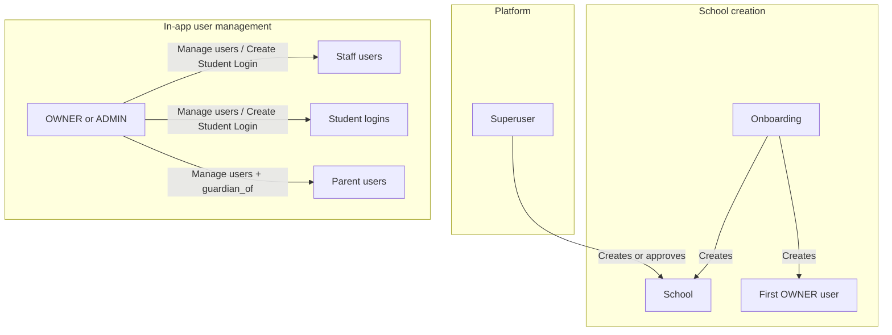
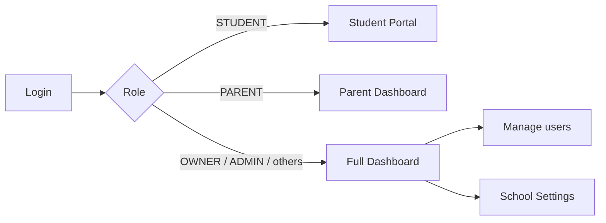
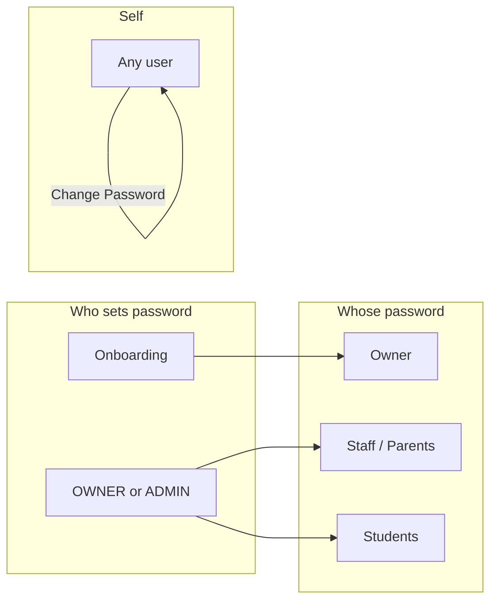

# Better System Design – Users, Onboarding, Roles & Passwords

This document describes an **improved** (clearer, simpler, more scalable) system for onboarding, users, roles, and passwords. It is a design/plan document; implementation can be phased later. It builds on the current state described in [USER_AND_ONBOARDING_GUIDE.md](USER_AND_ONBOARDING_GUIDE.md).

---

## 1. Current pain points

- **Multiple passwords to manage:** Owner sets own (onboarding), OWNER/ADMIN sets staff/student/parent passwords (Add user, Create Student Login), and users may change their own — no single mental model.
- **Many roles:** Seven roles (OWNER, ADMIN, ACCOUNTANT, TEACHER, STAFF, STUDENT, PARENT) without a clear grouping, so "who can do what" is harder to explain.
- **Unclear "who does what":** Platform vs school vs first owner vs in-app user creation is spread across onboarding, School Settings, and student profile; new admins get confused.
- **Onboarding vs in-app split:** New schools use onboarding (3 steps); existing schools add users from School Settings → Manage users. The link between "first account" and "rest of accounts" is not obvious.

---

## 2. Improved system design (recommendations)

### 2.1 Single entry for "who creates what"

One clear hierarchy:

- **Platform admin (Django superuser):** Creates or approves **schools** (e.g. "Add school" or onboarding result). Does not create school users.
- **School (onboarding):** Creates **one school** and **one OWNER user**. That is the only time a school and its first user are created together.
- **OWNER / ADMIN:** Create **all other users** for that school (staff, student logins, parents) via **School Settings → Manage users** (and "Create Student Login" on a student record for students).

**Optional future improvement:** "Invite by email" flow — OWNER/ADMIN enters email, system sends an invite link; user sets password once via link. This reduces manual password handling and "share password securely" friction.

### 2.2 Role simplification (optional)

Keep the current seven roles. Add a **role groups** summary so the mental model is clearer:

| Group | Roles | Purpose |
|-------|--------|---------|
| **Management** | OWNER, ADMIN | Full control: settings, users, backup (OWNER only), all modules |
| **Teaching** | TEACHER | Students, attendance, exams, learning, timetable |
| **Operations** | STAFF, ACCOUNTANT | Day-to-day: library, transport, HR; fees and receipts (ACCOUNTANT) |
| **Consumers** | STUDENT, PARENT | Limited: student portal (materials); parent dashboard (linked children only) |

No mandatory removal of roles; this is only a clearer way to explain and document them.

### 2.3 Password strategy

| Who | Whose password | How (current / recommended) |
|-----|----------------|-----------------------------|
| **New school (onboarding)** | Owner's | Owner sets own password in Step 2. **Recommended:** Keep as-is. |
| **Staff / parents** | Set by OWNER/ADMIN | Add user: set initial password. **Optional:** "Must change password on first login" flag so user sets their own after first login. |
| **Students** | Set by OWNER/ADMIN | "Create Student Login" → temp password; share securely. **Optional:** "Change on first login" or one-time invite link. |
| **Self-service** | Any user (own) | Profile → "Change Password". **Future:** "Forgot password" link with email reset. |

Summary: onboarding owner sets own; OWNER/ADMIN sets everyone else’s initial password; optional "change on first login" and future "forgot password" reduce confusion and support load.

### 2.4 Onboarding UX

- **Keep 3 steps:** (1) School details, (2) Owner account, (3) Review & create.
- **Add short labels:** e.g. "Step 1: School", "Step 2: Your account", "Step 3: Go live".
- **Add one sentence per step** for "what happens next":
  - After Step 1: "Next you’ll create the owner login for this school."
  - After Step 2: "Next you’ll review and create the school. You’ll then log in with this account."
  - After Step 3: "After this, you’ll log in and add users from School Settings → Manage users."

This makes the flow and the link to in-app user creation explicit.

---

## 3. Flow diagrams (Mermaid)

### 3.1 Who creates users



### 3.2 Role-based landing (after login)



### 3.3 Password responsibility matrix



---

## 4. Out of scope for this doc

- Actual code or schema changes.
- Implementation details (URLs, view names, form fields). See [USER_AND_ONBOARDING_GUIDE.md](USER_AND_ONBOARDING_GUIDE.md) and codebase for current behaviour.

Implementation of the above (invite flow, "change on first login", forgot password, onboarding copy) can be phased as separate tasks.

---

## 5. UI guidelines (design system reference)

For a consistent look and feel across the app:

- **Colors:** Use CSS variables (e.g. `--color-primary`, `--color-success`) for primary, semantic, and neutral colors. Avoid hardcoded hex in templates.
- **Typography:** One font stack app-wide (e.g. Nunito); define sizes and weights in variables.
- **Spacing:** 4px base scale; use for padding and margins on cards, forms, tables.
- **Components:** Buttons, inputs, cards, tables, badges — all use the same radius, shadow, and color variables so public pages (landing, login, onboarding) and app pages (dashboard, lists, forms) feel like one product.

See `static/css/variables.css` and `static/css/theme.css` for the single source of truth.

---

## Appendix: Volt Dashboard UI integration

You are a senior Django UI-integration agent operating inside Cursor IDE with full repo access.

### GOAL

Integrate the Volt Dashboard (Django version) design into the current project without touching business logic, database models, or existing API routes. This is a layout/theme merge only.

### PROJECT ASSUMPTIONS

- The repo already runs successfully.
- Django templates + static configured.
- You can read/write all files.
- Do not ask user for confirmation. Execute safely.

---

### STEP 0 — ANALYZE PROJECT

1. Scan repo root.
2. Detect:
   - Django version
   - templates directory
   - static directory
   - base template file
3. Print tree summary.
4. Identify current base layout used by pages.

**Do NOT modify anything yet.**

---

### STEP 1 — FETCH VOLT SOURCE

Download Volt Django dashboard source.

**If git available:**

```bash
git clone https://github.com/app-generator/django-volt-dashboard.git temp_volt
```

**If not:** download zip and extract to `/temp_volt`.

---

### STEP 2 — EXTRACT ONLY REQUIRED FILES

**From temp_volt copy ONLY:**

**TEMPLATES**

- `temp_volt/templates/layouts/base.html`
- `temp_volt/templates/includes/`
- `temp_volt/templates/pages/dashboard.html` (reference)

**STATIC**

- `temp_volt/static/assets/`

**Paste into current project:**

- `/templates/layouts/base.html`
- `/templates/includes/...`
- `/static/assets/...`

**Do NOT copy:**

- apps
- models
- migrations
- auth system

Delete `temp_volt` after extraction.

---

### STEP 3 — STATIC PATH FIX

Open `layouts/base.html`.

Ensure top contains:

```django

```

Replace all asset paths with:

```django

```

**Example:**

- `href="/static/assets/css/volt.css"`  
- → `href=""`

---

### STEP 4 — SETTINGS VALIDATION

Open `settings.py`.

Ensure:

- `TEMPLATES` `DIRS` includes `BASE_DIR / 'templates'`
- `STATICFILES_DIRS` includes `BASE_DIR / 'static'`

If missing → add safely.

Do not overwrite existing settings.

---

### STEP 5 — BASE TEMPLATE ADOPTION

Find current base template used across project.

For each page template, replace:

```django

```

with:

```django

```

Keep page content inside:

```django

...

```

Automate this across templates folder.

---

### STEP 6 — SIDEBAR URL BINDING

Open: `/templates/includes/sidebar.html`

Replace static links:

- `href="index.html"` → `href=""`

Map links to existing project routes.

If dashboard route missing, create view:

**views.py:**

```python
def dashboard(request):
    return render(request, "pages/dashboard.html")
```

**urls.py:**

```python
path("", views.dashboard, name="dashboard")
```

---

### STEP 7 — REMOVE CSS CONFLICTS

Scan project for:

- Bootstrap
- Tailwind
- AdminLTE
- other dashboards

**Rules:**

- Only ONE Bootstrap version allowed.
- If project already uses Bootstrap: remove duplicate imports from base template OR Volt template.
- Volt CSS should load last.

---

### STEP 8 — PAGE MIGRATION

Move existing pages into Volt layout.

**Example:**

- `templates/home.html` → `templates/pages/home.html`

Ensure:

```django

```

Test rendering.

---

### STEP 9 — RUN TEST

Execute:

```bash
python manage.py runserver
```

Check:

- sidebar visible
- navbar visible
- CSS loads
- no console errors
- no template errors
- all routes working

Fix static 404 if any.

---

### STEP 10 — CLEANUP

Delete unused Volt demo pages:

- charts
- widgets
- sample forms

Keep only layout + components used.

---

### SUCCESS CRITERIA

- Existing backend unchanged
- Volt UI fully applied
- No duplicate CSS frameworks
- All pages render inside Volt layout
- Project still runs clean

**If any failure occurs:** Stop → print error → fix → continue.

*END EXECUTION.*
