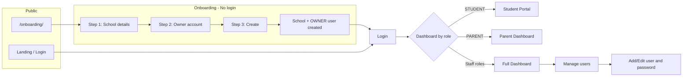

# User, Onboarding, Roles & Interface – Clarification

This guide answers: **who owns the software vs the school, where school profile is created, where onboarding fits, who assigns users, what interface each role sees, what roles exist, and how passwords are managed.** (Based on the current codebase.)

---

## 1. Software "owner" vs School owner

- **Software/platform owner:** You (developer/vendor). You sell or host this ERP for schools.
- **Each school's owner:** The school that registers via **onboarding**. After onboarding, **one user with OWNER role** is created — that user is the school's owner (admin) and manages everything for that school (users, settings, fees, etc.).
- **Multi-tenant:** One software instance can have **multiple schools**. Each school has its own subdomain/data. Only **Django superuser** sees all schools at the platform level (e.g. "Manage Schools" link).

---

## 2. Where is school profile created? → Onboarding

- **School profile (School + first Owner)** is created only through **onboarding**.
- **Onboarding URL:** `/onboarding/` (public, no login required).
- **Entry points:**
  - Login page: **"New school? Register your school"** → `/onboarding/`
  - Landing page: **"Register your school"** button → `/onboarding/`

**3 steps:**

| Step | What you enter | Result |
|------|-----------------|--------|
| 1 | School name, address, school code, subdomain code | Saved in session |
| 2 | Owner account: username, email, password (min 8 chars) | Saved in session |
| 3 | Review → "Create school & owner account" | **1 School + 1 User (OWNER)** created, redirect to login |

Onboarding is used **only when a new school** is registering. For an existing school, everything is done after login (users, settings, etc.).

---

## 3. Who assigns users?

- **Only OWNER and ADMIN** can add or edit users.
- **Where:** After login → **School Settings** (sidebar: "School Settings") → **"Manage users"** link → Manage users page (`/school/users/`).
  - **"Add user"** → username, email, **password**, **role** (OWNER, ADMIN, ACCOUNTANT, TEACHER, STAFF, STUDENT, PARENT).
  - **Edit user:** From the same list, Edit → change role, active/inactive, **password reset** (optional field).
  - **Student login:** On a student **record**, "Create Student Login" button (OWNER/ADMIN) → creates a user for that student with an auto-generated temp password (you share username/password securely).
  - **Parent:** OWNER/ADMIN gives PARENT role in "Manage users" and in Edit sets **guardian_of** (linked students).

**Summary:** User assignment is done by **OWNER or ADMIN** via **School Settings → Manage users**.

---

## 4. What interface does each role see?

- **STUDENT:** After login → **Student Portal** (`/student/`) — only "My Materials" + Logout (minimal sidebar).
- **PARENT:** After login → **Parent Dashboard** — data for their linked children (attendance, fee, reports); sidebar shows "Parent" / "Command Center".
- **Other roles (OWNER, ADMIN, ACCOUNTANT, TEACHER, STAFF):** Full **staff dashboard** (Command Center) — Students, Attendance, Exams, Learning Hub, Timetable, Finance, Transport, Library, HR. OWNER/ADMIN get extra: **School Settings**, **Manage users**, Academic years, etc.
- **Superuser:** Extra "Platform Admin" → "Manage Schools" (list of all schools).

Sidebar in `members/templates/master.html` is controlled by `is_student`, `is_parent`, `is_owner`, `is_admin`. Student portal uses its own minimal sidebar in `members/templates/student_portal.html`.

---

## 5. Roles – quick reference

| Role | Who assigns | Interface | Main access |
|------|-------------|-----------|-------------|
| **OWNER** | Onboarding (first) or same school's OWNER/ADMIN | Full dashboard + School Settings, Manage users, Backup | Everything in that school |
| **ADMIN** | OWNER/ADMIN (Manage users) | Same as OWNER (Settings, users, etc.) | Same as OWNER (backup is OWNER only) |
| **ACCOUNTANT** | OWNER/ADMIN | Full staff dashboard, Finance focus | Fees, receipts, expense |
| **TEACHER** | OWNER/ADMIN | Full staff dashboard | Students, Attendance, Exams, Learning, Timetable |
| **STAFF** | OWNER/ADMIN | Full staff dashboard | Library, Transport, HR (per role guards) |
| **STUDENT** | OWNER/ADMIN (Create Student Login) | Student Portal only | Only own materials |
| **PARENT** | OWNER/ADMIN + guardian_of link | Parent Dashboard | Only linked students |

See [MODULES_AND_FEATURES.md](MODULES_AND_FEATURES.md) for the "Quick reference (by role)" table.

---

## 6. Who manages which password?

| Who | Whose password | Where / how |
|-----|-----------------|-------------|
| **New school (onboarding)** | Owner's | Step 2: owner username + password. This is the **owner's first login**. |
| **OWNER/ADMIN** | Staff/users (ADMIN, TEACHER, etc.) | Manage users → Add user: set password. Edit user: "New password (leave blank to keep)" to reset. |
| **OWNER/ADMIN** | Student | "Create Student Login" → temp password auto-generated; share it securely. |
| **Each user (self)** | Own | Profile page → **"Change Password"** → Django's `/accounts/password_change/`. |

**To avoid confusion:**

- **One school = one first OWNER** from onboarding; all other users are added **inside** the app by that school's OWNER/ADMIN.
- **Each login (username) has one password**; OWNER/ADMIN can **set/reset** other users' passwords; users can **change their own** via "Change Password".

---

## 7. Flow diagram (simplified)

---

## Summary (one line)

Software is yours; school profile is created via **onboarding** (new school only); **user assignment** is done by OWNER/ADMIN via "Manage users"; **interface** depends on role (student = portal, parent = parent dashboard, others = full dashboard); **passwords** are managed via onboarding (owner), Add/Edit user (staff/student logins), and "Change Password" (self).
